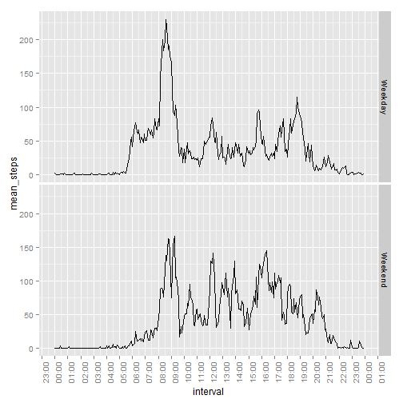

## Loading and preprocessing the data
First, we need to load the data, and convert dates to Date format:

```r
activity <- read.csv("activity.csv")
suppressMessages(library(lubridate))
activity$date <- ymd(activity$date)
int <- (hm(gsub("^([0-9]{2})([0-9]+)$","\\1-\\2",sprintf("%04d",activity$interval))))
activity$interval <- as.POSIXct(int,origin = ymd("2000-01-01"),tz="UTC")
```

It is a good idea to perform some exploratory analysis, to see what patterns can be observed in the data:

```r
summary(activity)
```

```
##      steps             date               interval                  
##  Min.   :  0.00   Min.   :2012-10-01   Min.   :2000-01-01 00:00:00  
##  1st Qu.:  0.00   1st Qu.:2012-10-16   1st Qu.:2000-01-01 05:58:45  
##  Median :  0.00   Median :2012-10-31   Median :2000-01-01 11:57:30  
##  Mean   : 37.38   Mean   :2012-10-31   Mean   :2000-01-01 11:57:30  
##  3rd Qu.: 12.00   3rd Qu.:2012-11-15   3rd Qu.:2000-01-01 17:56:15  
##  Max.   :806.00   Max.   :2012-11-30   Max.   :2000-01-01 23:55:00  
##  NA's   :2304
```

We learn from here that there are +2300 missing values for variable `steps`, that measurements were taken in october and november, 2012 and what the approximate distribution of `interval` is.

## What is mean total number of steps taken per day?
First, we need to generate a histogram of total number of steps by day:

```r
suppressMessages(library(dplyr))
suppressMessages(library(ggplot2))
suppressMessages(library(scales))
activity %>% 
    group_by(date) %>% 
    summarize(st=sum(steps,na.rm=T)) %>% 
    ggplot(.,aes(st))+geom_histogram()
```

```
## stat_bin: binwidth defaulted to range/30. Use 'binwidth = x' to adjust this.
```

 

Then, we calculate the average (mean) and median of steps walked each day:

```r
temp <- activity %>% 
    group_by(date)%>% 
    summarize(st=sum(steps,na.rm=T)) %>% 
    filter(!is.na(st)) %>% 
    summarize(mean_steps=mean(st),median_steps=median(st))
```

In a day, 9354.23 steps are walked in average, while 50% of the time (median), 10395 are walked.

## What is the average daily activity pattern?
First, let's generate a plot of the average number of steps, for each interval:

```r
activity %>% 
    group_by(interval) %>% 
    summarize(mean_steps=mean(steps,na.rm=T)) %>% 
    ggplot(.,aes(x=interval,y=mean_steps))+geom_line()+
      scale_x_datetime(breaks="1 hour",labels=date_format("%H:%M"))+
      theme(axis.text.x = element_text(angle = 90, hjust = 1))
```

 

Then, we find the interval that matches the maximum number of steps:

```r
stepsInterval <- activity %>% 
    group_by(interval) %>% 
    summarize(mean_steps=mean(steps,na.rm=T))
j <- which.max(stepsInterval$mean_steps)
maxInt <- stepsInterval$interval[j]
maxStep <- stepsInterval$mean_steps[j]
```

The interval that contains the maximum average number of steps is 08:35, with 206.17 steps.

## Imputing missing values
First, we calculate again the number of missing values:

```r
missing <- sum(is.na(activity$steps))
missing
```

```
## [1] 2304
```

Then, we aim to replace each missing value with the average steps for the interval for which the missing value exists. In order to do that, we will make use of the `data.table` package, making a copy of the original dataset:

```r
suppressMessages(library(data.table))
setDT(activity)
newActivity <- copy(activity)
newActivity[,steps:=ifelse(is.na(steps),as.integer(mean(steps,na.rm = T)),steps),by=interval]
```

We will then produce a histogram and recalculate mean and median values of steps taken per day, to see the impact of replacing missing values:

```r
newActivity %>% 
    group_by(date) %>% 
    summarize(st=sum(steps,na.rm=T)) %>% 
    ggplot(.,aes(st))+geom_histogram()
```

```
## stat_bin: binwidth defaulted to range/30. Use 'binwidth = x' to adjust this.
```

 

```r
newTemp <- newActivity %>% 
    group_by(date)%>% 
    summarize(st=sum(steps,na.rm=T)) %>% 
    filter(!is.na(st)) %>% 
    summarize(mean_steps=mean(st),median_steps=median(st))

tb <- rbind(temp,newTemp)
rownames(tb) <- c("Original","Modified")
suppressMessages(library(xtable))
xt <- xtable(tb)
print(xt,type="html")
```

<!-- html table generated in R 3.2.2 by xtable 1.8-0 package -->
<!-- Tue Nov 10 01:08:23 2015 -->
<table border=1>
<tr> <th>  </th> <th> mean_steps </th> <th> median_steps </th>  </tr>
  <tr> <td align="right"> Original </td> <td align="right"> 9354.23 </td> <td align="right"> 10395 </td> </tr>
  <tr> <td align="right"> Modified </td> <td align="right"> 10749.77 </td> <td align="right"> 10641 </td> </tr>
   </table>

By replacing the missing values with interval averages, both the mean and median *increased* their values.

## Are there differences in activity patterns between weekdays and weekends?
In order to find differences in activity patterns between weekends and weekdays, we first need to create a variable wich holds that bit of information. To avoid generating an error because of system language, we need to get the language used to display date / time, and save it to afterwards return to default settings. We also need to set the language to English while doing the comparisson:

```r
lcTime <- Sys.getlocale(category = "LC_TIME")
Sys.setlocale("LC_TIME", "English")
```

```
## [1] "English_United States.1252"
```

```r
newActivity[,dayType:=factor(ifelse(weekdays(date) %in% c("Saturday","Sunday"),"Weekend","Weekday"))]

newActDay <- newActivity[,.(mean_steps=mean(steps)),by=.(interval,dayType)]
ggplot(newActDay,aes(interval,mean_steps))+
    geom_line()+facet_grid(dayType~.)+
    scale_x_datetime(breaks="1 hour",labels=date_format("%H:%M"))+
    theme(axis.text.x = element_text(angle = 90, hjust = 1))
```

 

There are, indeed, differences between weekday and weekend activity profiles. Weekdays have a marked peak early in the morning, this peak could be as much as two times the second highest value during the day. On the other hand, weekends seem a "flatter" pattern during the day, as well as some activity that goes beyond 20:00, which is not usual during weekdays.

We finally need to return the locale to the one the user had before running this piece of code:

```r
Sys.setlocale("LC_TIME",lcTime)
```

```
## [1] "English_United States.1252"
```
